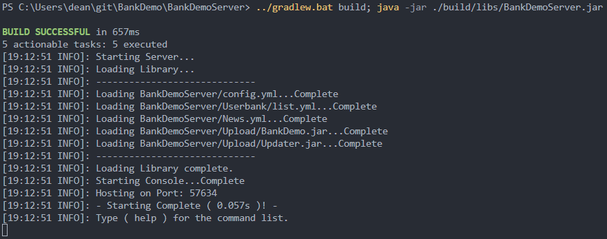
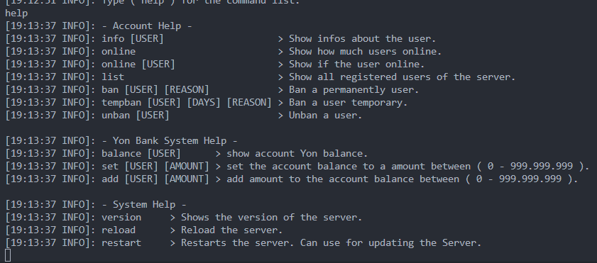
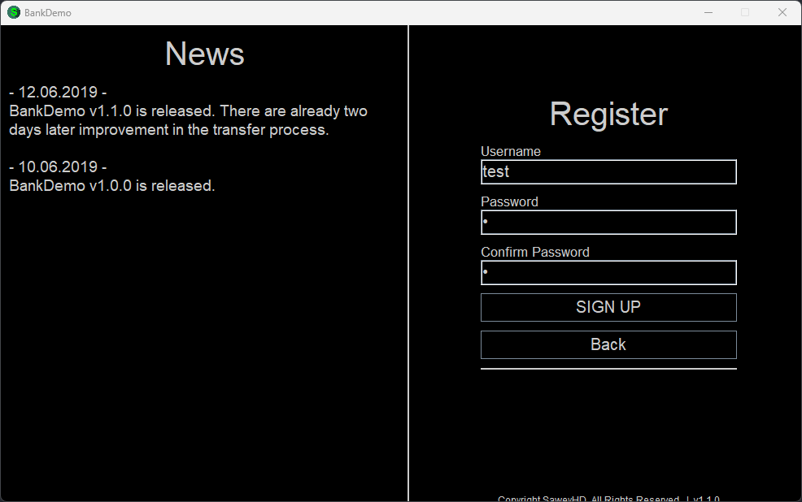
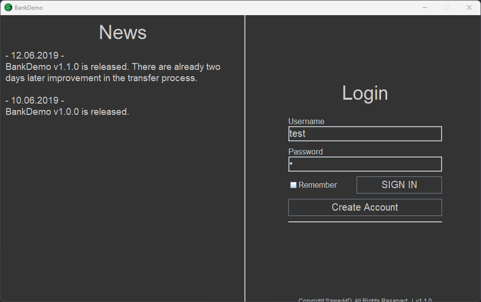
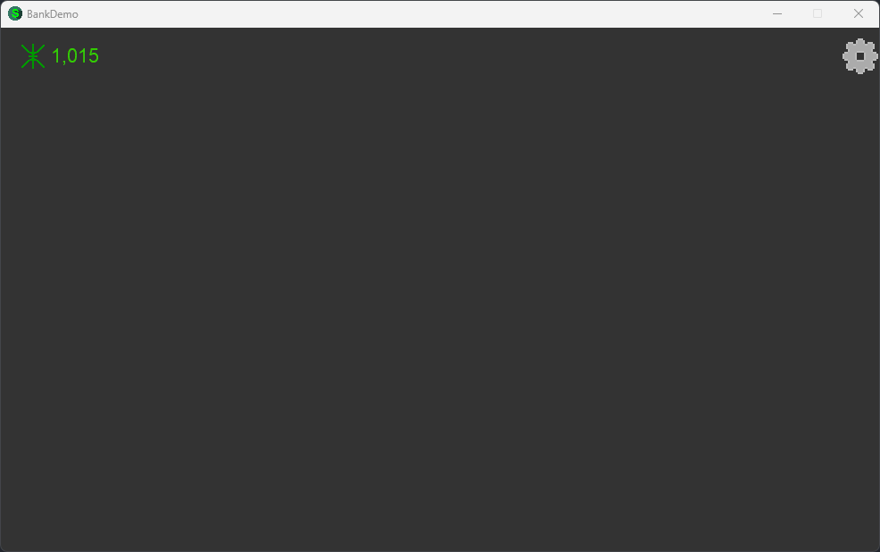
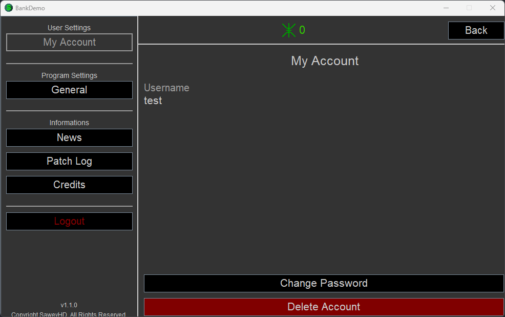
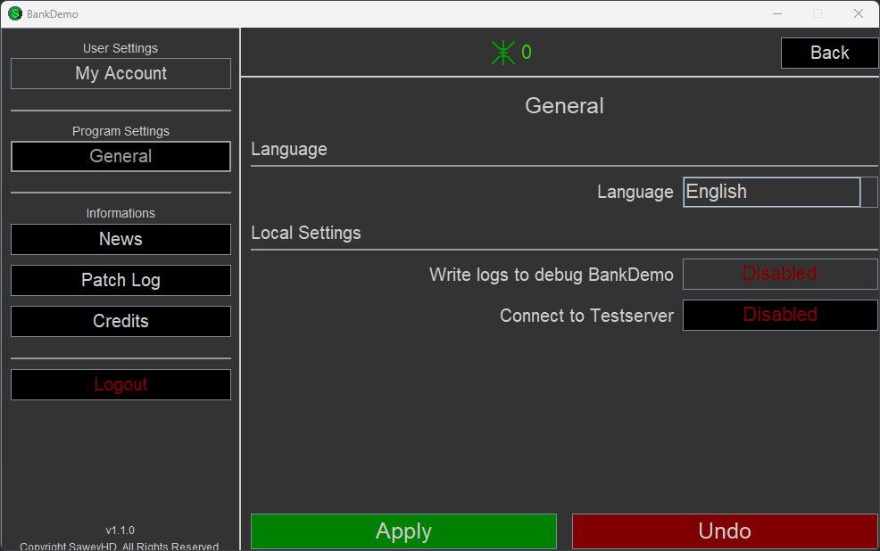
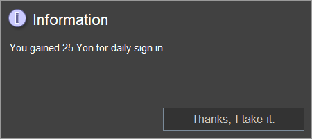
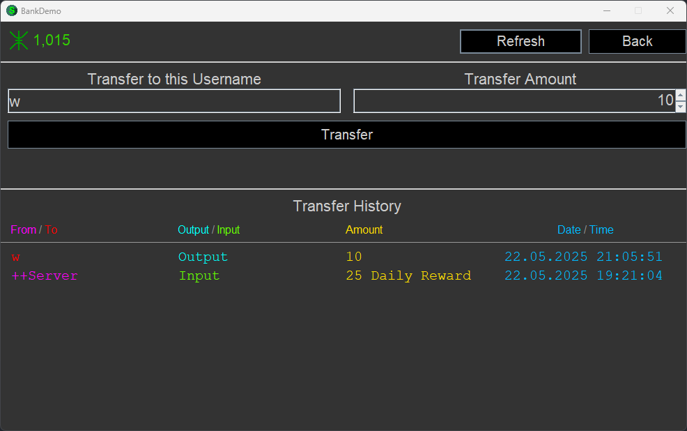

# BankDemo

**Zeitraum: Januar 2019 bis Juni 2019**

**Wiederbesucht: 22.05.2025**

Dies war eines meiner ersten Projekte – mein Ziel war es, Java zu lernen.
Ich war damals 13 Jahre alt, was man an vielen Stellen merkt,
zum Beispiel an der Rechtschreibung oder dem allgemeinen Aufbau des Codes.
Der Quellcode ist objektiv nicht gut geschrieben,
aber genau das macht das Projekt im Rückblick so interessant.

Ursprünglich begann alles mit einem einfachen Login-System.
Damit der Login auch einen Zweck erfüllte, entwickelte ich anschließend ein Banksystem,
welches in der Zukunft dafür genutzt werden sollte um ein Glückspiel zu spielen.
Man erhält die virtuellen Tokens in dem man sich täglich einloggt.
Vorher hatte ich bereits durch Minecraft-Server erste Erfahrungen mit Servertechnik gesammelt.
Die Inspiration durch Minecraft ist stellenweise erkennbar,
etwa bei der Idee von „Plugins“ (hier „Modules“) oder den Befehlen,
die direkt über die Server-Konsole eingegeben werden konnten.

Technische Besonderheiten:

- Internetkommunikation über unverschlüsselte Sockets
- Keine Datenbank: Alle Daten werden in lokalen Dateien gespeichert
- Automatischer Updater
- Unterstützung für verschiedene Sprachen
- Plugins
- ...

# Build and Run

Führe diese beiden Befehle jeweils in zwei seperaten Windows Terminals aus:

### Server

```bash
../gradlew.bat build; java -jar build/libs/BankDemoServer.jar
```

### Client

```bash
../gradlew.bat build; java -jar build/libs/BankDemo.jar
```

# Vorschau

### Server





### Client











Zu beginn hat man kein Guthaben. Man kann es über die Serverconsole hinzufügen.

```
add test 1000
```

Man erhält die virtuellen Tokens auf natürliche Weise, in dem man sich täglich einloggt.
Wir können die Wartezeit künstlich reduzieren, in dem wir die Nutzerdatei
`BankDemoServer/Userbank/test/properties.user` bearbeiten:

```yml
LastDailyReward=22.05.2025
```

Ändern zu:

```yml
LastDailyReward=21.05.2025
```

So sieht die Nachricht aus die man erhält:




